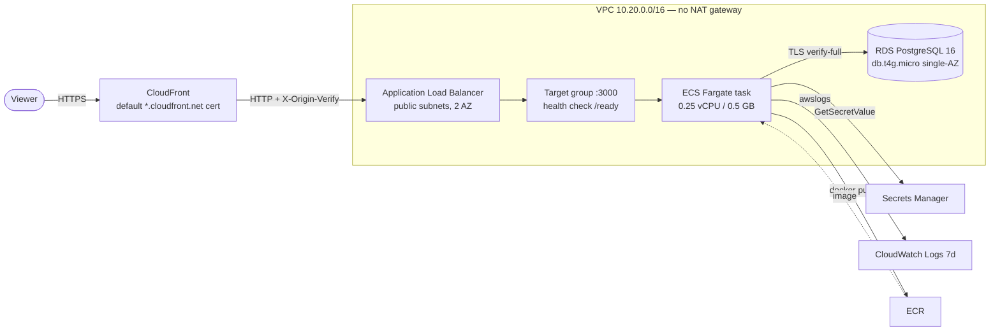

# ShelfOps AWS infrastructure (Terraform, ephemeral, ~USD 0)

Reproducible AWS environment for the ShelfOps API. `terraform apply` brings up
CloudFront → ALB → ECS Fargate → RDS PostgreSQL, and `terraform destroy` tears it
down. It is designed to be **ephemeral**: bring it up for a demo, then destroy it
the same day. Nothing here is a 24/7 production deployment.

> **Cost warning.** RDS and the ALB bill by the hour even with no traffic. Always
> run `terraform destroy` after a demo and verify there are no leftover resources.
> Create the USD 1 budget before the first real apply.

## Architecture



Trust boundaries:

- The ALB security group accepts port 80 **only** from the CloudFront
  `com.amazonaws.global.cloudfront.origin-facing` managed prefix list, and the
  listener only forwards requests carrying the generated `X-Origin-Verify`
  header. Everything else gets `403`.
- The task security group accepts its container port **only** from the ALB.
- The RDS security group accepts 5432 **only** from the task. RDS runs in private
  subnets with `rds.force_ssl = 1`; the API uses `DATABASE_SSL_MODE=verify-full`
  with the RDS CA bundle baked into the image.
- There is **no NAT gateway**. Fargate tasks sit in public subnets and receive a
  public IP through the ECS `assignPublicIp` setting; the security groups above
  keep them unreachable except from the ALB.

## Modules

| Module | Resources |
| --- | --- |
| `modules/network` | VPC, 2 public + 2 private subnets, IGW, route tables, ALB/task security groups, stripped default security group |
| `modules/database` | DB subnet group, database security group, `postgres16` parameter group, encrypted `db.t4g.micro` instance |
| `modules/compute` | ECR, ECS cluster/service, least-privilege task + execution roles, log group, one-off task definition |
| `modules/ingress` | CloudFront distribution, ALB, target group, secret origin header, listener rule |
| `modules/secrets` | Secrets Manager secrets (`DATABASE_URL`, `CURSOR_SECRET`, `METRICS_BEARER_TOKEN`, OIDC client secret) |
| `modules/observability` | SNS alarm topic, ALB/ECS/RDS alarms, CloudWatch dashboard |
| `modules/budgets` | Optional AWS Budgets USD alert |
| `modules/github_oidc` | GitHub OIDC provider, plan/deploy/apply roles, plan, deploy and apply policies |
| `modules/ci_boundary` | `${name}-ci-boundary` permissions boundary carried by every role the stack creates |

Roots: `bootstrap/` (state bucket) and `envs/demo/` (the stack).

## Prerequisites

- Terraform >= 1.10 (S3 native lockfile), AWS CLI v2, Docker.
- AWS credentials for a real apply. Never commit them; all resources are created
  from the CLI or CI with short-lived credentials.

## Local development with LocalStack (no AWS spend)

The free LocalStack tier does **not** emulate ECR, ECS, RDS, ELBv2 or CloudFront
— they require a paid plan (see [LocalStack findings](#localstack-findings)). The
`localstack` flag disables those modules so the supported subset still applies:

```sh
cd infra/terraform/envs/demo
terraform init -backend=false
terraform apply -var 'localstack=true'   # secrets + observability only
terraform destroy -var 'localstack=true'
```

Run LocalStack itself with Docker, for example:

```sh
docker run -d --name localstack -p 4566:4566 \
  -e SERVICES=s3,secretsmanager,sns,cloudwatch,logs,iam,sts,kms \
  localstack/localstack:4.4.0
```

### LocalStack findings

Verified against <https://docs.localstack.cloud/aws/licensing/> and the
per-service coverage pages, then exercised locally:

- **Free Hobby plan:** ECR ❌, ECS ❌, RDS ❌, ELBv2 ❌, CloudFront ❌ (all Base+);
  Secrets Manager ✅, SNS ✅, CloudWatch metrics/logs ✅, S3 ✅, IAM ✅, KMS ✅.
  AWS Budgets has no coverage page and is not emulated.
- **Since LocalStack 2026.03.0 an auth token is required** to start any image.
  `localstack/localstack:latest` (2026.8.5) exits with code 55:
  `License activation failed ... No credentials were found`.
- Exercised end-to-end with the last token-free community image
  `localstack/localstack:4.4.0` (`edition: community`):
  - `bootstrap` → 7 resources added (versioned, encrypted, TLS-only S3 bucket),
    destroyed cleanly even with a versioned object present.
  - `envs/demo -var localstack=true` → 19 resources added (Secrets Manager
    secrets + versions, SNS topic, CloudWatch dashboard, guard, the GitHub OIDC
    provider, the plan/deploy/apply roles and their policies, plus the
    `shelfops-demo-ci-boundary` policy and its ARN guard), destroyed cleanly; the
    backend state file lived in the LocalStack S3 bucket.
  - The three CI roles came back from `iam get-role` with
    `PermissionsBoundary: arn:aws:iam::000000000000:policy/shelfops-demo-ci-boundary`,
    and the deploy policy rendered `ecs:RunTask` on the one-off task definition
    family only, with the `ecs:cluster` condition. **IAM authorization is not
    enforced by LocalStack**, so the runtime effect of those conditions is not
    exercised there.
  - **Not exercised:** network/DNS, RDS, ECR, ECS/Fargate, ALB and CloudFront.
    Those are only validated statically (`terraform validate`, tflint, checkov).

## Real AWS demo procedure

```sh
# 0. Budget: create the USD 1 budget first (or reuse the account's existing one).
cd infra/terraform
terraform -chdir=bootstrap init
terraform -chdir=bootstrap apply -var 'state_bucket_name=shelfops-tfstate-<ACCOUNT-ID>'
```

```sh
# 1. Configure the demo root with the state bucket from step 0.
cd envs/demo
cp backend.hcl.example backend.hcl          # fill bucket/region, never commit
terraform init -backend-config=backend.hcl
terraform apply -var 'container_image=placeholder'  # first apply creates ECR
```

```sh
# 2. Build and push the image to the ECR repository Terraform created.
ECR=$(terraform output -raw ecr_repository_url)
aws ecr get-login-password | docker login --username AWS --password-stdin "${ECR%%/*}"
docker build --platform linux/amd64 -f ../../../Dockerfile.api -t "$ECR:$(git rev-parse --short HEAD)" ../../..
docker push "$ECR:$(git rev-parse --short HEAD)"
terraform apply -var "container_image=$ECR:$(git rev-parse --short HEAD)"
```

```sh
# 3. Run migrations, then the tenant bootstrap, as one-off ECS tasks.
eval "$(terraform output -raw migrate_task_command)"
eval "$(terraform output -raw seed_tenant_task_command)"   # fill the <placeholders>
```

```sh
# 4. Smoke test through CloudFront (first distribution deployment can take a few minutes).
curl --fail "$(terraform output -raw smoke_url)"     # expect {"status":"ready"}
```

```sh
# 5. Tear down and verify nothing is left.
terraform destroy
terraform -chdir=../bootstrap destroy -var 'state_bucket_name=shelfops-tfstate-<ACCOUNT-ID>'
aws ecs list-clusters
aws rds describe-db-instances --query 'DBInstances[].DBInstanceIdentifier'
aws elbv2 describe-load-balancers --query 'LoadBalancers[].LoadBalancerName'
aws cloudfront list-distributions --query 'DistributionList.Items[].Id'
```

A forced 5xx alarm email can be triggered by requesting a path that makes the API
return 503 (for example by scaling the service to zero tasks while the target
group health check fails); the SNS subscription must be confirmed by email first.

## TRUST_PROXY finding

CloudFront appends the viewer address to `X-Forwarded-For` and the ALB appends
the CloudFront address, so the API sees **two** trusted proxy hops. With
`TRUST_PROXY=1` the API would resolve the CloudFront IP instead of the real
client and rate limiting would bucket every viewer together. The demo root sets
`TRUST_PROXY=2` (`var.trust_proxy_hops`). Behind an ALB only, use `1`; directly
exposed, use `false`.

## Estimated cost (24/7, us-east-1, on-demand)

All figures are **estimates** from the public AWS on-demand pricing pages,
rounded, excluding taxes, free-tier credits and data transfer beyond the free
allowance. 730 hours/month.

| Resource | Configuration | Hourly | Monthly (730 h) |
| --- | --- | --- | --- |
| RDS instance | `db.t4g.micro`, single-AZ, PostgreSQL 16 | ~$0.0163 | ~$11.90 |
| RDS storage | 20 GB gp3 + 1 day backups | — | ~$2.30 |
| Application Load Balancer | 1 ALB, minimal LCU | ~$0.0225 + LCU | ~$17.00–20.00 |
| ECS Fargate | 1 task, 0.25 vCPU / 0.5 GB | ~$0.0123 | ~$9.00 |
| Secrets Manager | 4 secrets | — | ~$1.60 |
| ECR | <1 GB image | — | ~$0.05 |
| S3 state | a few KB | — | <$0.01 |
| CloudFront | PriceClass_100, low volume | — | $0.00–2.00 |
| CloudWatch Logs/alarms/dashboard | 7-day logs, ~7 alarms, 1 dashboard | — | $0.00 (free tier) |
| SNS email | a few emails | — | $0.00 |
| Public IPv4 addresses | 2 for the ALB + 1 for the Fargate task, $0.005/h each | ~$0.015 | ~$11.00 |
| **Total** | | | **~$53–59/month** |

**Conscious omissions** that keep it cheap: no NAT gateway (~$32/month saved), no
WAF (~$5+/month), no VPC endpoints (~$7+/month each), no Multi-AZ, no
Performance Insights, no KMS customer-managed keys, CloudFront without custom
domain/ACM.

**Actual demo cost:** the hourly resources sum to roughly **$0.08/hour**, so a
four-hour demo costs about **$0.32**, plus a few cents of prorated monthly
storage/secret charges. This is well within AWS free-plan credits, but verify the
account's current terms before applying.

## Production variant (conscious cost decision)

The demo runs tasks in public subnets with a public IP and keeps RDS private. For
a production deployment:

- Move Fargate tasks to **private subnets** and add either a **NAT gateway**
  (~$32/month + data) or **VPC endpoints** for ECR, S3, CloudWatch Logs, Secrets
  Manager and RDS.
- Enable **Multi-AZ** RDS, longer backup retention, deletion protection and a
  customer-managed KMS key.
- Put **WAF** in front of CloudFront/ALB and add **ALB access logs**.
- Use a purchased domain with an **ACM certificate** and a CloudFront alias
  instead of the default certificate.
- Keep the Terraform modules; only the root variables and the `enable_*` flags
  change.

## Terraform state

- `bootstrap/` creates a versioned, AES256-encrypted, TLS-only S3 bucket with
  `force_destroy = true` so `destroy` also removes the demo state file. It uses
  local state itself.
- `envs/demo/` uses a partial S3 backend with native S3 lockfile (`use_lockfile =
  true`), configured through `backend.hcl` (copy of `backend.hcl.example`). No
  account id is committed.

## Budgets

The demo can create a USD 1 monthly budget (`enable_budget = true`,
`alarm_email`). The account already has a budget named **"My Zero-Spend Budget"**,
so leave `enable_budget = false` to avoid a duplicate; the module is optional and
skipped automatically under LocalStack.

## CI/CD

GitHub Actions authenticates to AWS with **OIDC: no long-lived access keys are
stored in GitHub**. The demo root creates the OIDC provider and three roles
(`enable_github_oidc`, default true), each trusted for exactly one subject:

| Role | OIDC subject | Purpose |
| --- | --- | --- |
| `*-github-plan` | `repo:Mateocas1/shelfops:pull_request` | Read-only `terraform plan` on infra PRs + state lock |
| `*-github-deploy` | `repo:Mateocas1/shelfops:ref:refs/heads/main` | Push images, register task definitions, run the migration task, roll the service |
| `*-github-apply` | `repo:Mateocas1/shelfops:environment:demo-apply` | Manual `terraform apply`/`destroy`, gated by a protected environment |

No thumbprint is configured: since 2023-07-06 AWS validates GitHub's IdP against
its own trusted root CAs instead of a pinned thumbprint
([GitHub changelog](https://github.blog/changelog/2023-07-13-github-actions-oidc-integration-with-aws-no-longer-requires-pinning-of-intermediate-tls-certificates/),
[terraform-provider-aws#32480](https://github.com/hashicorp/terraform-provider-aws/issues/32480)).

### Permissions boundary

Every role the stack creates — task, task-execution, plan, deploy and apply —
carries the managed policy `${name}-ci-boundary` (`modules/ci_boundary`). A
permissions boundary grants nothing on its own: it is a *ceiling* that the role's
identity policies and the boundary must both allow, so it lists the demo services
terraform manages plus the project-scoped IAM, state-bucket and OIDC-provider
actions. The boundary sits in the root rather than in `modules/github_oidc`
because that module already consumes the compute outputs while the apply role
needs the boundary ARN in a condition: owning it there would be a module cycle.

The apply role may create a role, set its permissions boundary, write an inline
policy or attach a policy **only while that same boundary is attached**
(`iam:PermissionsBoundary` condition). On top of that the boundary itself denies:

- creating or widening a project role that does *not* carry this boundary;
- `CreatePolicyVersion`, `DeletePolicy`, `DeletePolicyVersion` and
  `SetDefaultPolicyVersion` on the boundary policy;
- `DeleteRolePermissionsBoundary` anywhere.

This is the AWS-documented delegation pattern
([permissions boundaries](https://docs.aws.amazon.com/IAM/latest/UserGuide/access_policies_boundaries.html),
[per-action condition keys](https://docs.aws.amazon.com/service-authorization/latest/reference/list_iam.html),
[delegation example](https://aws.amazon.com/blogs/security/delegate-permission-management-to-developers-using-iam-permissions-boundaries/)).
Two consequences are deliberate:

- **Changing the boundary is an administrator action.** The apply role can create
the policy but never rewrite or delete it, so an edit to `modules/ci_boundary`
needs an administrator (or a manual policy edit) before it reaches the next
apply. That is exactly what stops an apply from widening its own ceiling.
- **`terraform destroy` stops at the boundary.** Deleting `${name}-ci-boundary`
is denied to the apply role, so a full destroy leaves that one policy behind;
an administrator removes it after the stack is gone. Everything else destroys
normally.

### One-time setup

1. Apply the stack (this also creates the OIDC provider and roles):
   ```sh
   cd infra/terraform/envs/demo
   terraform init -backend-config=backend.hcl
   terraform apply -var "state_bucket_name=<your-state-bucket>" -var "container_image=<ecr>:bootstrap"
   ```
   If the account already has a GitHub OIDC provider, apply with
   `-var manage_oidc_provider=false -var oidc_provider_arn=<existing-arn>`.
2. Create the GitHub **variables** below (Settings → Secrets and variables →
   Actions → Variables). They are not secrets: no AWS keys are stored.
3. Create two GitHub **environments**: `demo-deploy` (no required reviewers) and
   `demo-apply` with **required reviewers** so apply/destroy needs a human
   approval. The name `demo-apply` must match `github_environment_name`.
4. Push to `main`: the Deploy workflow builds both images, runs migrations, rolls
   the service and smokes `/ready`. Open an infra PR: the plan workflow posts one
   sticky comment. Apply/destroy only through the **Infra apply** workflow dispatch.

### Required GitHub variables

| Variable | Example | Notes |
| --- | --- | --- |
| `AWS_REGION` | `us-east-1` | Region of the stack |
| `AWS_DEPLOY_ROLE_ARN` | `terraform output -raw github_deploy_role_arn` | Deploy workflow |
| `AWS_PLAN_ROLE_ARN` | `terraform output -raw github_plan_role_arn` | Plan workflow |
| `AWS_APPLY_ROLE_ARN` | `terraform output -raw github_apply_role_arn` | Apply/destroy workflow |
| `TF_STATE_BUCKET` | `shelfops-tfstate-<account>` | Same bucket as the S3 backend |
| `TF_CONTAINER_IMAGE` | `<ecr>:<current-sha>` | Current API image, keeps `plan` meaningful |
| `TF_MIGRATE_IMAGE` | `<ecr>:<current-sha>-migrate` | Optional; defaults to the API image |
| `ECR_REPOSITORY` | `<account>.dkr.ecr.<region>.amazonaws.com/shelfops-demo-api` | Full repository URL |
| `ECS_CLUSTER` | `shelfops-demo-cluster` | Name or ARN; the `RunTask` condition (`ecs:cluster`) is ARN-valued |
| `ECS_SERVICE` | `shelfops-demo-api` | |
| `API_TASK_DEFINITION` | `shelfops-demo-api` | Family name |
| `ONE_OFF_TASK_DEFINITION` | `shelfops-demo-one-off` | Family name (migrate / seed-tenant) |
| `ECS_PUBLIC_SUBNETS` | `subnet-a,subnet-b` | Comma-separated, no spaces |
| `ECS_TASK_SECURITY_GROUP` | `sg-...` | Task security group |
| `SMOKE_URL` | `https://<cloudfront>/ready` | CloudFront readiness URL |
| `ALARM_EMAIL` | `you@example.com` | Optional |
| `TF_MANAGE_OIDC_PROVIDER` | `false` | Optional; set when the provider already exists |
| `TF_OIDC_PROVIDER_ARN` | `arn:aws:iam::...:oidc-provider/token.actions.githubusercontent.com` | Optional; pairs with the previous |

### Behaviour

- **Ephemeral no-op:** if `AWS_DEPLOY_ROLE_ARN` is unset, or `describe-services`
  finds no service, the Deploy workflow logs a notice and exits 0.
- Deploy builds the `runtime` and `migrate` Docker targets (two different images:
  the migrate image carries `scripts/migrate.cjs` and `migrations/`), registers new
  task-definition revisions from the current family, runs the one-off migration
  task and **fails on a non-zero exit code**, then waits for `services-stable`
  before the `SMOKE_URL` check. The deploy role may only `ecs:RunTask` the one-off
  task definition family on the `ECS_CLUSTER`; `DescribeTasks`/`ListTasks` cannot
  be scoped by task definition and stay on `*`.
- `apply`/`destroy` are never automatic; they require a `workflow_dispatch` input
  plus the `demo-apply` environment approval.

## Verification status

- `terraform fmt -check -recursive`, `terraform validate` (both roots), `tflint`
  and `checkov` are green and run in `.github/workflows/infra.yml` without AWS
  credentials. Checkov's deliberate cost skips are documented in
  `infra/terraform/.checkov.yaml`.
- All five workflows pass `actionlint`; the four AWS workflows are covered by
  `packages/test-support/src/ci-workflow.test.ts` (SHA-pinned actions, OIDC, no
  stored secrets, sticky plan comment, protected dispatch), and
  `packages/test-support/src/terraform-iam-boundary.test.ts` locks the IAM
  invariants (boundary statements and protections, the apply role's
  `iam:PermissionsBoundary` conditions, the boundary on all five roles, and the
  `RunTask` scope).
- The LocalStack subset applies and destroys cleanly, including the GitHub OIDC
  module (provider + three roles with the expected `sub` conditions and the
  attached permissions boundary); see [LocalStack findings](#localstack-findings).
- **Not yet verified against real AWS:** CloudFront/ALB wiring, ECS task
  startup, RDS TLS `verify-full` against the real RDS endpoint, alarm email
  delivery, and the full apply under 20 minutes. Those require a human-approved
  apply with real credentials. The same applies to the IAM semantics introduced
  here: the `iam:PermissionsBoundary` conditions and denies, the `ecs:cluster`
  condition on `RunTask` (ECS resolves a short cluster name to its ARN before
  evaluating it), and the deliberate consequence that the apply role cannot
  delete `${name}-ci-boundary`, so `terraform destroy` leaves that one policy for
  an administrator.
