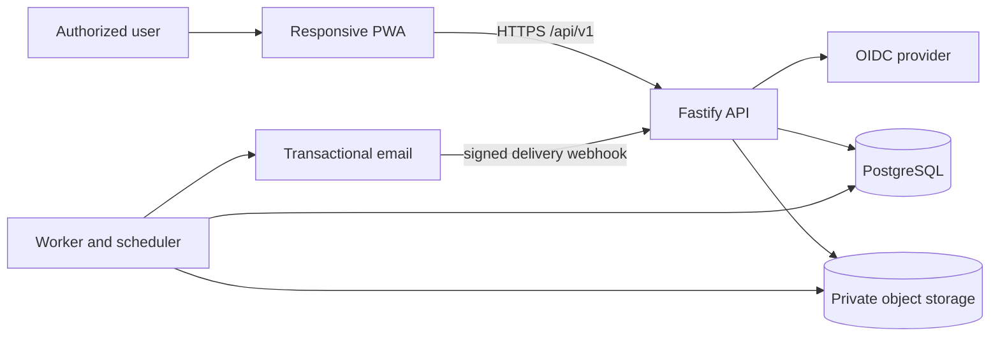

# ShelfOps MVP Technical Design

## Decision summary

ShelfOps will be a TypeScript modular monolith with three deployable processes from one workspace: a responsive React PWA, a Fastify HTTP API, and a background worker. PostgreSQL is the transactional source of truth and durable job/outbox store; private S3-compatible storage holds evidence. Domain rules remain plain TypeScript behind explicit ports so framework, identity, email, and object-storage choices can change without rewriting the incident model.

This is the smallest architecture that provides atomic incident actions, authoritative authorization, deterministic rules, auditable history, reliable notifications, and documented client contracts. It deliberately excludes microservices, native mobile applications, multi-organization tenancy, autonomous AI, and external retail integrations.

## Review path

Review these decisions in order:

1. Confirm the modular-monolith boundary and transactional data flow.
2. Confirm authorization, lifecycle, SLA, notification, and evidence invariants.
3. Confirm the API/PWA degraded-connectivity contracts.
4. Confirm pilot operations, testing, and unresolved pre-production decisions.

## Architecture drivers and selected stack

| Concern | Decision | Driver and portability boundary |
| --- | --- | --- |
| Runtime | Node.js 22 LTS, TypeScript in strict mode | One language across client, API, worker, contracts, and deterministic rule tests. Domain code uses no Node or framework globals. |
| Workspace | `pnpm` workspaces | Fast, deterministic installs and explicit package boundaries. Packages remain standard npm packages. |
| PWA | React, Vite, React Router, TanStack Query, Workbox, IndexedDB through a small draft repository | Responsive client, app-shell caching, explicit server-state handling, and controlled local drafts. Domain authority remains on the server. |
| API | Fastify with TypeBox JSON schemas and `@fastify/swagger` | Schema-based validation and generated OpenAPI with low runtime overhead. HTTP adapters call application use cases; they do not contain business rules. |
| Database | PostgreSQL 16, `pg`, Kysely, SQL migrations | Transactions, row locking, constraints, JSONB event snapshots, and `SKIP LOCKED` jobs. Kysely is confined to infrastructure repositories. |
| Background work | Worker process using PostgreSQL job/outbox tables | Avoids Redis or a separate broker for pilot scale while preserving retry and deduplication semantics. A queue adapter can replace it later. |
| Evidence | Private S3-compatible object storage behind an `EvidenceObjectStore` port | Works with cloud object storage and MinIO locally. Database metadata remains authoritative. |
| Identity | OIDC Authorization Code flow; the PWA uses a BFF-style opaque secure session cookie | Standards-based identity without browser token persistence. Provider-specific code is isolated in an identity adapter. |
| Email | Transactional email provider behind a `MailGateway` port; Mailpit in development | Provider delivery identifiers and webhooks are adapter concerns. `delivered` is recorded only from positive provider confirmation. |
| Tests | Vitest, Testcontainers, Playwright, OpenAPI lint/diff checks | Explicit unit, integration, contract, and browser boundaries. |
| Packaging | OCI images; static PWA assets served through a CDN or API static host | Deployable on common managed container platforms without binding domain logic to one cloud. |

## System context and data flow



A successful business mutation follows one server-owned path:

1. Authenticate the principal and load active roles, scopes, responsibilities, and grants from PostgreSQL.
2. Canonicalize the request and resolve its idempotency identity.
3. Load the visible aggregate under a row lock where applicable, verify the expected version, authorize the action, and validate references and domain preconditions.
4. Run a pure application/domain use case.
5. In one PostgreSQL transaction, update current state, append material events, update SLA records, create eligible in-app notifications and email delivery records, enqueue durable work, store the idempotent result, and increment versions.
6. Commit before returning success. External object transfer and email sending are never performed inside the database transaction.
7. Workers claim committed jobs, recheck authorization where disclosure may have changed, execute side effects, and append attributable outcomes.

A denied, invalid, stale, or indeterminate action commits no operational side effects. Security denial telemetry is separate from incident history and contains no restricted incident details.

## Repository and module boundaries

```text
apps/
  web/                    React PWA and service worker
  api/                    Fastify composition root, HTTP and auth adapters
  worker/                 SLA, outbox, evidence, and email workers
packages/
  domain/                 entities, value objects, policies, state machines, rules
  application/            use cases, ports, transaction boundary contracts
  contracts/              TypeBox API schemas, enums, error and pagination contracts
  infrastructure/         PostgreSQL, object storage, OIDC, mail implementations
  test-support/           deterministic clocks, builders, fixtures, test adapters
openapi/                   generated OpenAPI document and examples
migrations/                ordered SQL migrations
infra/                     local Compose and deployment manifests
```

Allowed dependency direction is `apps/adapters -> application -> domain`. `contracts` may share stable vocabulary with the domain but must map transport types explicitly. `infrastructure` implements application ports. The domain cannot import Fastify, React, Kysely, provider SDKs, environment variables, or system time.

This is a modular monolith, not a generic layered framework. Modules scream the product capabilities: identity/access, reference data, incidents, evidence, triage, recurrence, SLA, notifications, and operational views. Cross-module changes occur through use cases and persisted events, not direct table writes from route handlers.

### WU-05 package-boundary prerequisite and conformance correction

Ordinal 48 is functionally green and its behavioral evidence remains valid, but WU-05 is architecture-not-accepted: the API currently redeclares application contracts and duplicates session validation. WU-06 remains blocked until both work units below pass.

#### Boundary decisions

| Decision | Selected design | Rejected alternative and rationale |
| --- | --- | --- |
| Buildable packages | Add explicit private ESM workspace packages `@shelfops/domain` and `@shelfops/application`. Each owns a manifest and TypeScript build with `rootDir: src`, `outDir: dist`, declarations, and test-source exclusion. | Direct cross-package source imports fail API `rootDir` ownership with TS6059; widening `apps/api/tsconfig.json` would blur deployable boundaries. |
| Dependency direction | Enforce `apps/api -> @shelfops/application -> @shelfops/domain`; domain imports neither application nor API. API keeps its existing `rootDir: src`. | Structural compatibility is insufficient because local declarations can silently drift. |
| Workspace artifacts | Treat both manifests, workspace dependencies, and `pnpm-lock.yaml` as part of the boundary. API depends on `@shelfops/application`; application depends on `@shelfops/domain`. | Undeclared source reach-through is not an acceptable workspace dependency. |
| Clean ordering | Add one root producer-build command used by clean contract/typecheck gates: domain, then application, then contracts, then root `tsc --noEmit`. Root build must use the resulting dependency graph or an equivalently proven topological command. | Depending on stale `dist` output creates false-green clean checks. Generated `dist` remains ignored and is removed after verification. |

Public exports are deliberately narrow and mirror the existing `@shelfops/contracts/common` convention:

| Package | Required subpaths |
| --- | --- |
| `@shelfops/domain` | `authorization/types`, `authorization/visibility-policy`, `authorization/action-policy`, `authorization/assignment-eligibility` |
| `@shelfops/application` | `authorization/authorized-principal`, `identity/session`, `ports/identity-provider` |

`AuthorizedPrincipal` imports domain vocabulary through `@shelfops/domain/authorization/types`; no package exports a broad root barrel.

#### Autonomous work units and likely files

| Unit | Likely files and outcome |
| --- | --- |
| **WU-05P — package boundary** | Create `packages/{domain,application}/{package.json,tsconfig.json}`; modify `packages/application/src/authorization/authorized-principal.ts`, root `package.json`, `apps/api/package.json`, and `pnpm-lock.yaml`; add `apps/api/test/application-package.contract.test.ts`. Its RED must be absent package/export/import resolution, then prove API-owned tests can import application public subpaths without source paths. |
| **WU-05C — API conformance** | Modify `apps/api/src/auth/session-boundary.ts`, `apps/api/src/app.ts`, and `apps/api/test/auth.contract.test.ts`; add `apps/api/test/auth-boundary-structure.contract.test.ts`. Delete API-local `AuthorizedPrincipal`, `IdentitySession`, and `IdentityProvider`; import the canonical application contracts; replace local `isCurrentSession` and direct `lookupSession` validation with application `resolveSession`. The structural sentinel rejects reintroduced local declarations, validation, or application source-path imports. |

WU-05C preserves every ordinal-48 behavior and test assertion: real `buildApi()` registration, `/health`, opaque session handling, current-access reload, CSRF, safe errors, local issuer smoke, and production rejection of development adapters. Existing auth tests change only to consume public imports where necessary. It neither chooses a pilot identity provider nor adds a production vendor.

#### Focused verification and rollback

| Unit | Planned proof | Autonomous rollback boundary |
| --- | --- | --- |
| WU-05P | RED/GREEN `pnpm test:contract -- application-package`; build domain, application, and contracts from a clean tree; run API build, clean root typecheck, and existing contracts-package sentinel; assert no direct `packages/*/src` API imports; remove all generated `dist`. | Revert the two package definitions, public-import rewiring, root/API manifest changes, lockfile, and package-boundary test together. Ordinal-48 behavior remains, but WU-05 stays architecture-not-accepted. |
| WU-05C | RED/GREEN `pnpm test:contract -- auth-boundary-structure`; run `pnpm test:unit -- identity`, `pnpm test:contract -- auth`, clean API/root typechecks/build, then the existing local issuer smoke and full gate required by apply. | Revert only API conformance imports/delegation, updated auth test imports, and sentinel while retaining WU-05P. WU-05 remains unaccepted and WU-06 blocked. |

Threat matrix: N/A — these units change package ownership and internal delegation, not route semantics, shell/subprocess behavior, VCS automation, executable classification, or process integration. RDD remains disabled.

### WU-07C → WU-07 reference-configuration amendment

WU-07P ordinal 61 remains accepted. Add independently reversible **WU-07C — Reference-configuration composition and idempotency prerequisite** (approximately 300 lines) before API-only WU-07; it owns no route/OpenAPI/docs behavior. Reserve `migrations/004_reference-configuration-idempotency.sql`; WU-08S becomes `migrations/005_incidents-core.sql`, and later renumbering belongs to the tasks amendment. Order: `WU-07P -> WU-07C -> WU-07 -> WU-08S`.

#### Interfaces and dependency rule

```ts
type IdempotencyScope = Readonly<{ principalId: string; apiMajor: "v1"; operation: "configure-location"; targetKey: string; key: string }>;
type ConfigurationInput = Readonly<{ storeId: string; locationId: string; expectedVersion: number; effectiveAt: string; effectiveUntil?: string; active: boolean; label?: string; idempotencyKey: string; correlationId: string }>;
type ConfigurationCommand = Readonly<{ eventId: string; target: "store-reference" | "organization-catalog"; referenceId: string; storeId: string; expectedVersion: number; effectiveAt: string; effectiveUntil?: string; active: boolean; label?: string; actorId: string }>;
type ConfigurationOutcome = Readonly<{ status: 200; eventId: string; version: number; before: Record<string, unknown>; after: Record<string, unknown>; effectiveAt: string; correlationId: string }>;
interface ConfigurationExecutor { execute(principal: AuthorizedPrincipal, input: ConfigurationInput): Promise<ConfigurationOutcome>; }
type IdempotencyRecord = Readonly<{ state: "pending" | "completed"; requestHash: string; outcome?: ConfigurationOutcome; expiresAt: string }>;
interface IdempotencyStore { find(scope: IdempotencyScope): Promise<IdempotencyRecord | undefined>; insertPending(scope: IdempotencyScope, requestHash: string, expiresAt: string): Promise<void>; complete(scope: IdempotencyScope, outcome: ConfigurationOutcome): Promise<void>; }
type ConfigurationTransactionContext = Readonly<{ idempotency: IdempotencyStore; repository: ConfigurationRepository; newEventId(): string }>;
```

The route passes only parsed path/body/header values as eventId/actor/target-free `ConfigurationInput` plus the guard-owned principal to `ConfigurationExecutor.execute(principal, input)`. After an absent idempotency lookup, Application `executeConfiguration` calls `context.newEventId()` exactly once, then derives `ConfigurationCommand` as `{ eventId, target: "store-reference", referenceId: input.locationId, storeId: input.storeId, expectedVersion, effectiveAt, effectiveUntil, active, label, actorId: principal.id }`, reuses WU-07P authorization/effective-range behavior, and calls the transaction-bound repository. Organization-catalog is unreachable. `PostgresConfigurationExecutor` supplies the context and exclusively owns one `PoolClient`. Dependency/producer order is `API -> infrastructure -> application -> domain`, then contracts; API never imports domain.

#### Transaction and idempotency

The PostgreSQL executor performs `pool.connect -> BEGIN -> pg_advisory_xact_lock -> idempotency.find`. Scope is principal + `v1` + `configure-location` + `${storeId}/${locationId}` + `Idempotency-Key`; SHA-256 covers path IDs and normalized `{ expectedVersion, effectiveAt, effectiveUntil, active, label }`, excluding actor/correlation/eventId, with at least 24-hour retention. A completed equal hash replays its original status/eventId/version/before/after before version access or ID generation; a completed different hash throws `IdempotencyConflictError`. Otherwise transaction-local state advances `absent -> pending -> completed`, Application invokes the same transaction-bound repository, and the executor issues COMMIT. Repository `apply()` stops issuing nested transaction statements and removes `randomUUID()`; its injected `Database` inserts `command.eventId` into `configuration_events` in that PoolClient transaction, preserving WU-07P behavior.

Before COMMIT is issued, any error triggers best-effort ROLLBACK, then releases or destroys the client; no completed record is promised. If COMMIT resolves, return the completed outcome. If COMMIT throws or the connection drops after PostgreSQL may have received it, do not claim rollback: destroy the client and throw typed `IndeterminateCommitError(correlationId)` mapped to `503 temporarily-unavailable`. The durable outcome may be committed or absent. A same-key retry opens a new transaction and reads first: equal completed replays, changed completed conflicts, and absent may execute. It never blindly re-executes. Validation, authorization, not-found, and stale-version failures before COMMIT are rolled back and not completed; `StaleVersionError` and `IdempotencyConflictError` remain distinct 409 mappings.

#### Authentication, registration, and lifecycle

`apps/api/src/auth/mutation-guard.ts` exports `MutationPrincipalProvider` and `createMutationGuard(provider)`. The returned Fastify `preHandler` resolves the current session, validates active principal and CSRF, and attaches typed `request.authenticatedPrincipal`; it never reads actor from payload. `registerReferenceConfigurationRoute(app, { executor, mutationGuard })` attaches that guard specifically to `POST /api/v1/stores/{storeId}/locations/{locationId}/configuration`, rejects body `eventId`/`target`/actor/path IDs, builds only `ConfigurationInput` from path/body/`Idempotency-Key`/request correlation, then calls `executor.execute(request.authenticatedPrincipal, input)`.

`apps/api/src/routes/register.ts` is the single `buildApi()` registration path. Production `startApi()` validates nonblank `DATABASE_URL`, creates Pool through an injectable factory, and owns it until `buildApi()` installs one idempotent `onClose`; registration failure closes app/pool, returned app owns Pool, and listen failure calls `app.close()`. Injected tests/OpenAPI own no resource. `openApiDocument()` uses the same build path with non-executing dependencies. Application exports typed `StaleVersionError`/`IdempotencyConflictError`; infrastructure exports `IndeterminateCommitError`; the guard owns authentication/CSRF failures and the route maps `LocationNotFoundError`. `error-handler.ts` preserves `{ code, message, correlationId, fields? }`: validation 400, authentication 401, forbidden 403, missing/hidden 404, both typed conflicts 409, temporary/indeterminate 503.

#### Exact files, tests, and rollback

| Unit | Paths and focused RED |
| --- | --- |
| WU-07C | `migrations/004_reference-configuration-idempotency.sql`; `packages/application/src/ports/{configuration-repository,configuration-executor,idempotency-store}.ts`; `packages/application/src/reference-data/{configuration-executor,configuration-executor.test,configure-reference-data.test}.ts`; `packages/infrastructure/src/idempotency/postgres-idempotency-store.ts`; `packages/infrastructure/src/reference-data/{postgres-configuration-executor,postgres-configuration-repository}.ts`; `packages/infrastructure/test/reference-configuration-idempotency.test.ts`; `apps/api/src/{app,startup}.ts`; `apps/api/src/auth/{session-boundary,mutation-guard}.ts`; `apps/api/src/composition/reference-configuration.ts`; `apps/api/test/{mutation-guard,reference-configuration-composition}.contract.test.ts`; `packages/{application,infrastructure}/package.json`; `apps/api/package.json`; `apps/api/test/application-package.contract.test.ts`; root `package.json`, `pnpm-lock.yaml`. RED: `test:unit -- configuration-executor`, `test:unit -- configure-reference-data`, `test:integration -- reference-configuration-idempotency`, `test:contract -- mutation-guard`, `test:contract -- reference-configuration-composition`; prove public eventId rejection, one generated ID reaches repository/event row/completed outcome, same-key replay preserves it, changed payload conflicts, and preserve pre-COMMIT/indeterminate/close-once cases. |
| WU-07 | `apps/api/src/routes/{register,reference-configuration}.ts`, `apps/api/src/{app,openapi,error-handler}.ts`, `apps/api/test/reference-configuration.contract.test.ts`, generator, deterministic OpenAPI, examples, and guide. RED `test:contract -- reference-configuration` uses `buildApi()`/`app.inject()` fakes for 200/400/401/403/404/409/503, target/actor rejection, both 409 codes, registration parity, and two byte-identical generations. |

Rollback WU-07 removes only route/registration mappings and generated/docs artifacts. Rollback WU-07C removes only migration, ports/orchestration/adapters, transaction refactor, topology, guard/composition, and tests, retaining WU-07P; WU-07 becomes blocked. Measure complete lines before apply; if WU-07C cannot stay near 300 (hard contingency 350), split durable transaction/idempotency from API composition/lifecycle rather than exceed the boundary.

Threat matrix: Pool lifecycle is Applicable; invalid-config, registration, listen, and app-close REDs prove one owner. Documentation-like paths, Git selection, commit, push, and PR commands are N/A: no executable classification, shell, or VCS automation. Open questions: None.

## Relational model and identity

All durable identifiers are UUIDv7 generated server-side. All timestamps are `timestamptz` in UTC. Display localization uses the store timezone and never changes authoritative instants.

### Core tables

| Area | Main records and invariants |
| --- | --- |
| Organization | `organizations` has a singleton constraint for the MVP. Every operational table carries `organization_id` even though only one organization may exist. |
| Hierarchy | `stores`, `sectors(store_id)`, `locations(store_id, sector_id)`, `products`, `product_store_availability`. Foreign keys and composite constraints prevent cross-store sector/location relationships. |
| Identity and access | `users(oidc_issuer, oidc_subject, active)`, `user_roles`, `user_store_scopes`, `user_sector_scopes`, `category_responsibilities`, `action_grants`, and `sessions`. Unique `(issuer, subject)` identifies a user; roles never imply unrecorded scope. |
| Governed catalogs | Versioned `categories`, `category_policy_versions`, `severities`, `severity_versions`, `triage_rule_sets`, `recurrence_rule_versions`, `sla_matrix_versions`, `sla_rules`, and `alert_policy_versions`. Effective ranges cannot overlap for the same governed scope. |
| Incident current state | `incidents` stores current/provisional category and severity, state, reporter, scope, context, assignee, ownership-gap flag, reopen count, current SLA cycle, timestamps, and integer `version`. Historical labels and policy-version identifiers are snapshotted. |
| Decisions | `triage_evaluations`, `triage_decisions`, `recurrence_suggestions`, `recurrence_decisions`, and `recurrence_links`. Suggestions and human outcomes are separate records. |
| Evidence | `evidence_uploads`, `evidence_items`, `incident_evidence_links`, and `evidence_restrictions`. Object keys are opaque; checksums, detected media type, size, uploader, scan state, and retention state live in PostgreSQL. |
| SLA | `sla_cycles`, `sla_obligation_segments`, `sla_block_intervals`, `sla_events`, and `scheduled_jobs`. Every reopen creates a new cycle; amendments close and append segments. |
| Audit | `incident_events`, `configuration_events`, and restricted `security_events`. Incident events include event type, incident sequence, authoritative/effective and recorded times, actor/system origin, scope snapshot, before/after payload, reason, policy versions, evidence references, correlation ID, and superseded-event link. |
| Alerts | `notifications`, `email_deliveries`, `email_attempts`, and `outbox_jobs`. Notification read state belongs only to its recipient. Email delivery and attempts are separate so retries do not duplicate the logical alert. |
| API safety | `idempotency_records` stores key scope, canonical request hash, state, committed status/body reference, and expiry. |

Reference records are deactivated, not deleted. Incident snapshots preserve labels and applied definitions. Database roles deny application `UPDATE` and `DELETE` on append-only event tables; triggers provide a second guard. Corrections append a new event and mark the relationship to the superseded event without mutating prior content.

### Required indexes and constraints

- Unique incident event `(incident_id, sequence)` and ordering index `(incident_id, effective_at, event_id)`.
- Incident work-queue indexes beginning with authorized scope: `(organization_id, store_id, sector_id, state, updated_at, id)`, plus category, assignee, reporter, severity, and current SLA condition variants justified by query plans.
- Partial indexes for unresolved, unassigned, blocked, warning, and breached incidents.
- Recurrence lookup indexes `(organization_id, store_id, category_id, created_at desc)`, `(store_id, category_id, location_id, created_at desc)`, and `(store_id, category_id, product_id, created_at desc)`.
- Unique active assignment semantics enforced by the single `incidents.assignee_user_id` column and state checks.
- Unique alert deduplication key `(recipient_id, channel, incident_id, material_event_id, sla_cycle_id, threshold_key, reminder_occurrence)` with nullable values normalized into a generated key.
- Unique SLA event keys per `(cycle_id, obligation_segment_id, event_kind, threshold_key, reminder_occurrence)`.
- Unique idempotency scope `(principal_id, api_major, operation, target_key, idempotency_key)`.
- Job claim index `(state, available_at, id)` and email provider-message identifier index.
- Foreign keys use restrictive deletion. Check constraints cover enum values, positive versions, evidence sizes, effective ranges, and one-organization bootstrap.

Migrations are forward-only during the pilot. Each migration that transforms retained data includes a verification query and rollback/containment note; destructive migrations are prohibited while pilot records are retained.

## Authentication and role-plus-scope authorization

The PWA authenticates with OIDC Authorization Code flow. The API handles the callback and stores an opaque session identifier in an `HttpOnly`, `Secure`, `SameSite=Lax` cookie. Session state in PostgreSQL references the ShelfOps user; CSRF protection is required for cookie-authenticated mutations. The API verifies current user activity and authoritative access assignments on every request. Scope decisions are not taken from OIDC role claims or request payloads.

Authorization is implemented as two coordinated application components:

- `VisibilityPolicy` produces query predicates for lists, counts, filters, history, evidence, exports, and identifier lookup.
- `ActionPolicy` checks role, explicit grants, record scope, category responsibility, assignment, and lifecycle-specific conditions after a visible record is loaded.

Repositories require an `AuthorizedPrincipal` and cannot expose an unrestricted incident collection to API use cases. Detail lookups include visibility predicates in SQL, so hidden identifiers produce `404 not-found`. A visible record with a denied action produces `403 forbidden`. Assignment eligibility uses the same scope model. Role combinations union only their explicitly assigned scopes; assigned-only resolution and store-supervisor-only reopen remain hard invariants.

Deactivation or scope removal takes effect on the next request because the MVP has no long-lived authorization-decision cache. A transaction changing access also flags incompatible current assignees as ownership gaps and emits attributable configuration/security events. Queued disclosures re-evaluate recipient visibility before email send; notifications are re-authorized and redacted at read time.

The OIDC vendor, login policy, credential duration, and revocation settings remain a pilot decision, but the adapter contract and BFF session boundary are fixed by this design. Test-only identity adapters must be impossible to enable in production configuration.

## Incident aggregate, state machine, and concurrency

`Incident` is the transaction aggregate for current state, triage outcome, ownership, current SLA cycle, and material event append. The domain transition table contains exactly:

```text
open -> classified
classified -> in-progress
in-progress -> blocked
blocked -> in-progress
in-progress -> resolved
resolved -> open   (in-scope supervisor only)
```

No generic `setState` operation exists. Each action has a named use case such as `CompleteTriage`, `StartWork`, `BlockIncident`, `ResumeIncident`, `ResolveIncident`, and `ReopenIncident`. Reassignment and classification amendment preserve state. Reopen preserves prior resolution and evidence, clears assignment, retains category/severity as provisional, increments reopen count, starts a new SLA cycle, and starts fresh deterministic triage.

Every mutation carries `expectedVersion`. The transaction locks the incident row with `SELECT ... FOR UPDATE`, checks that version, re-evaluates authorization and preconditions, appends all effects, and increments the version once. A mismatch returns `409 stale-version` with the current version or retrieval URL and no side effect. Idempotent replay lookup occurs before stale-version classification so a lost response returns its original outcome.

## Deterministic triage and recurrence

Triage rule sets are immutable, versioned decision tables with explicit priority, predicates over normalized recorded inputs, and outputs for category, severity, and assignee-selection strategy. The pure evaluator accepts an input snapshot, rule version, eligible-assignee set, and clock value; it returns suggested values or `manual triage required`, matched rule IDs, normalized inputs, and explanation tokens rendered into concise text. Stable normalization and first-match ordering make repeated evaluation identical.

Human decisions are separate: each suggestion component is confirmed or corrected, and corrections require a reason. Manual fallback records the no-match result and rationale. The domain refuses `open -> classified` until all three final decisions exist and exactly one eligible assignee is selected.

The recurrence evaluator is also a pure versioned rule plus a repository query. The safe default searches prior incidents in the same store and category during the previous 30 elapsed days, requires exact shared location or product, orders by creation time and ID, and returns at most five. It records the compared values and matching basis. Unique pair/rule-version constraints suppress dismissed repeats. Confirmation creates a relationship only; it never merges aggregates or copies state, ownership, or SLA.

Rule explanation data is stored as structured input facts, matched clauses, output facts, and version IDs. Human-readable text is a projection, so wording can improve without changing the recorded decision basis.

## SLA engine, calendars, and scheduling

`SlaCalculator` is a pure service driven by a `Clock` and versioned rule snapshot. The MVP implements `continuous-elapsed-utc`; store timezone affects display only. A `BusinessCalendar` port and clock-mode discriminator make future business-hours rules possible, but no holiday/calendar behavior is shipped or implied in the MVP.

- Creation starts cycle 1 at authoritative creation time from provisional category/severity.
- Classification amendments close the current obligation segment and append a new segment calculated from the original cycle start. Past-due recalculation appends an immediate breach without removing prior events.
- Default blocked behavior continues time. A pausing rule records every blocked interval and extends only pending warning/deadline instants by total paused duration. Existing breaches remain breached.
- Resolution closes the cycle with terminal met/breached outcome. Later wall time cannot alter it.
- Reopen starts a separate cycle at authoritative reopen time using retained provisional values; later triage correction recalculates from that reopen time.

Each pending threshold is a durable scheduled job keyed by cycle, segment, threshold, and occurrence. The worker claims due jobs with `FOR UPDATE SKIP LOCKED`, recomputes from authoritative records, and in one transaction appends the deduplicated SLA event, updates current condition, creates alerts/deliveries, and schedules any allowed next reminder. Superseded jobs become cancelled/no-op through version checks. A delayed worker records the threshold's effective time separately from processing time; it does not falsify when the obligation was reached.

The safe seed uses the specified 72/24/8/2-hour targets, one warning, no blocked pause, and no repeated reminders. If repeat reminders are configured later, validation enforces at least a one-hour interval.

## Evidence storage

Attachment handling uses a staged flow because PostgreSQL and object storage cannot share a transaction:

1. The API authorizes the target scope and creates a short-lived, opaque staged-upload record.
2. The client uploads to a private quarantine prefix using a narrowly scoped signed request.
3. A worker validates declared size, magic-byte media type, checksum, and malware-scan result. Only `ready` uploads can satisfy evidence policy.
4. An incident action atomically creates the evidence item/link and material event referencing that ready object.
5. Unattached staged objects expire and are deleted after 24 hours. They are never represented as incident evidence.

Text evidence is stored transactionally in PostgreSQL. Attachments are limited by the active policy, with the safe defaults of five JPEG/PNG/PDF files at 10 MiB each. Downloads use short-lived references and re-authorize incident visibility before issuance. Buckets are private and encrypted. Content replacement is prohibited; superseding evidence creates a new item and event. A restriction removes access to content only through an attributable policy action while retaining metadata and an unavailable marker.

## Notifications, email, outbox, and idempotency

### Default alert event policy

`Operational lead` below means the active sector lead(s) for the incident sector, with active store supervisor(s) as fallback when no sector lead exists. `Configured responders` and `escalation recipients` are named users or responsibility groups whose role, category responsibility, explicit grants, and enumerated store/sector scope are revalidated for the incident. The action actor is not silently removed from a required recipient set.

| Material event | Default eligible recipients | Default channel | Deduplication identity/window | Pilot-configurable policy |
| --- | --- | --- | --- | --- |
| Non-critical incident creation | Reporter and operational lead responsible for triage | In-app required; no email by default | Recipient + channel + incident creation event ID; no time-window coalescing | Optional creation email may be enabled; non-mandatory operational-lead recipients may be narrowed, but at least one authorized triage recipient must remain |
| Critical incident creation | Reporter and operational lead receive in-app; every in-scope store supervisor and configured critical responder receives both channels | In-app required for all; email required for supervisors/responders | Recipient + channel + incident creation event ID; no time-window coalescing | Configured responder set and escalation scope; required supervisor/responder channels cannot be disabled by preference |
| Triage completion or category/severity correction | Reporter, resulting current assignee, and operational lead | In-app required; email optional and off by default | Recipient + channel + triage material event ID + triage decision-set ID; no time-window coalescing | Optional email and non-mandatory additional reviewers; required in-app recipients cannot be broadened outside visibility |
| Assignment or reassignment | New assignee; former assignee on reassignment; operational lead when reassignment changes active work | Both required for the new assignee; in-app required for former assignee and operational lead; their email is optional and off by default | Recipient + channel + assignment material event ID + assignment ID; each later reassignment is a distinct event, never a retry | Optional former-owner/lead email; new-assignee in-app/email cannot be disabled |
| Ownership gap caused by access or activity change | Operational lead and in-scope store supervisor | In-app required; email required | Recipient + channel + ownership-gap event ID; one alert per gap event until a later attributable reassignment or new gap | Additional authorized support recipients; mandatory lead/supervisor delivery cannot be removed |
| Work started | Reporter and operational lead | In-app required; email optional and off by default | Recipient + channel + start transition event ID; no time-window coalescing | Optional email and narrowing of non-mandatory additional observers |
| Blocked | Current assignee, operational lead, and in-scope store supervisor | Both required | Recipient + channel + blocked transition event ID; every later block interval has its own event | Additional authorized responders; mandatory recipients/channels cannot be disabled |
| Resumed | Current assignee, operational lead, and in-scope store supervisor | In-app required; email optional and off by default | Recipient + channel + resume transition event ID; every later resume has its own event | Optional email and narrowing of non-mandatory supervisor copies where an operational lead remains |
| Resolved | Reporter, current assignee, and operational lead | In-app required; email optional and off by default | Recipient + channel + resolution event ID + SLA cycle ID; no time-window coalescing | Optional email and additional authorized reviewers |
| Reopened | Reporter, former assignee, operational lead for the reopened incident, and in-scope store supervisor | Both required | Recipient + channel + reopen event ID + new SLA cycle ID; every reopen is distinct | Additional authorized responders; required recipients/channels cannot be disabled |
| Recurrence suggestion requiring decision | Reporter when allowed to decide on the reporter's own incident; otherwise configured recurrence reviewer; then authorized operational lead as fallback. Every selected reviewer must view both incidents | In-app required; email optional and off by default | Recipient + channel + suggestion ID + candidate incident ID + recurrence rule version; retained while pending/decided. A dismissal suppresses the same pair/rule version unless explicit reevaluation creates a new occurrence | Ordered reviewer assignment, additional authorized reviewers, optional email, and 1–90 day recurrence window; configuration cannot select a user unable to view both incidents |
| Recurrence confirmed | Reporter(s) and operational lead(s) that can view both incidents | In-app required; email optional and off by default | Recipient + channel + recurrence decision ID; confirmation produces one decision event even though it is visible from both incidents | Optional email and additional authorized reviewers with visibility to both incidents |
| Recurrence dismissed | Reporter of the current incident and operational lead(s) that can view both incidents | In-app required; email optional and off by default | Recipient + channel + recurrence decision ID; pair/rule-version suppression prevents repeated suggestions by default | Optional email and additional authorized reviewers with visibility to both incidents |
| SLA warning | Current assignee, operational lead, and configured in-scope warning recipients | Both required | Recipient + channel + SLA cycle + obligation segment + warning threshold + reminder occurrence. Default has one occurrence | Warning recipients; optional repeat reminders at intervals of at least one hour; required channels remain enabled |
| SLA breach | Current assignee, operational lead, in-scope store supervisor, and configured escalation recipients | Both required | Recipient + channel + SLA cycle + obligation segment + breach threshold + reminder occurrence. Default has one occurrence | Escalation recipients; optional repeat reminders at intervals of at least one hour; required channels remain enabled |

Every listed event is always evaluated, including events whose optional email is disabled. Policy configuration is immutable, versioned, scope-bound, attributable, effective prospectively, and snapshotted by the resulting alert records. Authorized pilot administrators may tune the explicitly configurable cells, user preferences for optional email, the conservative retry schedule, and outbound-email containment. They may narrow only non-mandatory recipients, cannot remove a specification-required in-app or email path, and cannot add any recipient who fails live role-plus-scope visibility. When one material event matches multiple rows, policy evaluation merges them into one logical alert per recipient/channel and applies the strongest required channel rule.

### Generation, eligibility, and delivery

Alert handling has three separate phases:

1. The business transaction appends the material incident/SLA event. The pure `AlertPolicyEvaluator` uses that event, the snapshotted policy version, and authoritative access records to generate candidate recipient/channel intents.
2. The same transaction accepts only currently authorized candidates, creates in-app notification records and logical email delivery records, records each eligibility basis and preference decision, and inserts outbox jobs. Rejected configured candidates create only a restricted administrative suppression outcome; no user-visible notification or incident content is disclosed.
3. After commit, workers claim email jobs and recheck user activity and incident visibility before each external delivery attempt. Provider calls are never part of event generation or eligibility evaluation.

Unique database keys use the matrix identities, not a broad time bucket, so retries and duplicate event processing reuse the original logical record while legitimate later transitions remain distinct. No second user-visible notification or email delivery record is created for a duplicate. Email attempts are child records of the original logical delivery.

Suppression is explicit and attributable. Stable reasons include `recipient-inactive`, `recipient-out-of-scope`, `role-or-grant-ineligible`, `optional-email-disabled`, `policy-narrowed`, `email-contained`, and `delivery-access-revoked`; restricted suppression records contain only safe identifiers and policy/correlation data. Loss of scope before send changes the queued email to `suppressed`; notification content is redacted on later reads if access is lost. Required email cannot be suppressed by personal preference, but authorization loss and pilot-wide containment still fail closed and remain traceable.

The safe retry schedule is immediate, five minutes, and twenty minutes: at most three attempts within 30 minutes. Permanent provider failures stop immediately. `sent` means provider acceptance; `delivered` requires a positively authenticated provider webhook. Webhook events are idempotent by provider event ID. Email failure never rolls back the incident action or in-app notification.

API mutation keys are scoped by principal, `/v1`, operation, target, and client key. A canonical semantic payload hash distinguishes equivalent retries from changed payloads. The implementation uses a PostgreSQL advisory lock for the scoped key and a transactional idempotency row. A committed action stores its response reference; a lost response is replayed. A concurrent request either waits for that result or receives a recoverable pending outcome. A changed hash returns `409 idempotency-conflict`. Records are retained for at least 24 hours.

## API contract

All product endpoints live under `/api/v1`. OpenAPI 3.1 is generated from the same TypeBox route schemas used for boundary validation, committed for review, linted, and checked for incompatible changes. The PWA uses only this public contract.

- Commands are named business-action endpoints rather than arbitrary state patches, for example `POST /incidents/{id}/actions/resolve`.
- Mutations require `Idempotency-Key` and incident/configuration `expectedVersion`; successful responses include the new version and correlation ID.
- Potentially unbounded collections use opaque cursor pagination, default 50 and maximum 200. Cursor payload binds sort, filters, authorization subject, and last unique key; it is integrity-signed and expires explicitly.
- Every ordering includes the stable ID tie-breaker. The default queue sort uses risk/action priority, update time, then incident ID.
- Contract schemas reject unknown lifecycle enums and client-owned actor, state, organization, audit-time, and server-time fields.
- Field validation returns all safely detectable errors. Domain errors map to the approved stable status/code table.
- Errors use `{ code, message, correlationId, fields? }` and never include stack traces or restricted metadata.
- Temporary inability to authenticate, authorize, lock, validate policy, or commit returns `503 temporarily-unavailable`; reads are never replaced by misleading empty results.
- Evidence transfer endpoints expose staged-upload status and short-lived authorized download references, not public object URLs.
- History is read-only and ordered by effective timestamp then event ID/incident sequence.

Additive optional changes are allowed within v1. Any change to lifecycle, authorization, meanings, or required fields requires a new approved spec and, if incompatible, a new API major version.

## PWA and degraded connectivity

The PWA is responsive from 360 CSS pixels upward, touch and keyboard operable, and does not rely on hover. Route-level layouts provide phone forms/cards, terminal-friendly controls, and wider dashboard tables without changing available business actions. TanStack Query owns server state; forms keep explicit pending, accepted, validation, authorization, conflict, and unknown-result states.

Workbox precaches only the application shell and static assets. API incident responses are not persisted by the service worker, so the MVP does not promise offline access to prior incidents. IndexedDB stores an unsent incident draft for up to 24 hours, partitioned by authenticated user and device. Sign-out deletes or cryptographically makes that user's drafts inaccessible. Attachment blobs are not retained by default; their metadata is marked `reattachment required` unless pilot device policy explicitly permits local blob retention.

Each draft owns one client-generated creation idempotency key. Offline submission remains `not reported` and has no server ID. If connectivity drops after send, the pending action retains the same key; reconnect performs an explicit status/retry flow and ends as accepted once, pending, validation failed, authorization failed, or conflicted. No autonomous background mutation synchronization is included. Other actions may keep in-memory recovery input, but only unsent creation drafts are durable offline.

A client-side disabled button reduces duplicate taps, but server idempotency and optimistic concurrency remain authoritative. On stale version, the PWA shows the current authorized representation and requires the user to review before creating a new key and retrying a revised action.

## Operational views and read models

The MVP avoids a separate analytics store. Current work queues and current-state counts query the indexed `incidents` table. Historical metrics query immutable SLA cycles, obligation segments, block intervals, recurrence decisions, and event-time snapshots. SQL views and explicit query objects form the read model; they are read-only and can later be replaced by rebuildable projections without changing API contracts.

Every query begins with the caller's visibility predicate before aggregation, grouping, filter suggestions, or pagination. There is no shared cross-principal response cache in the MVP. Current queues group by current values; historical performance groups by event-time snapshots. Responses include scope, filters, range, metric definition key/version, denominator where relevant, per-incident versus per-cycle basis, and database observation time as `lastRefreshedAt`. Empty denominators return `null/no-data`, not zero percent.

The queue priority is computed deterministically from breached, warning, critical, unassigned, blocked, remaining priority, updated time, and incident ID. `EXPLAIN (ANALYZE, BUFFERS)` against pilot-volume fixtures gates index additions. If pilot baselines show direct aggregation is insufficient, an outbox-fed projection table is the next step; it must be rebuildable from retained events and still apply live authorization scope.

## Security, privacy, and pilot operations

- TLS is mandatory outside local development. Cookies are secure/HTTP-only; CSRF tokens protect mutations; strict CSP, frame restrictions, and safe CORS defaults apply.
- Secrets come from the deployment secret store and are never written to logs, events, OpenAPI examples, or client bundles. Provider webhooks require signature and replay-window verification.
- Passwords are not stored by ShelfOps. Sessions are revocable, idle/absolute expiry is configurable, and sensitive configuration/export actions are attributable.
- Evidence buckets are private, encrypted at rest, scanned before attachment, and accessed through short-lived authorized references. Logs avoid evidence content, descriptions, email bodies, and object URLs.
- Rate limiting is applied by session/principal and endpoint class, with stricter limits for uploads, exports, login callbacks, and configuration. Numeric limits are environment configuration pending pilot volume baselines.
- Structured logs, metrics, and traces carry correlation ID, operation, safe principal ID, outcome code, latency, job lag, retry count, and database health. They do not carry restricted incident content.
- Alerts cover API error rate, database saturation, outbox/SLA job age, permanent email failures, evidence-scan backlog, backup failure, and storage errors. Product SLA deadlines are never conflated with platform SLOs.
- PostgreSQL uses daily backups plus point-in-time recovery in pilot, with quarterly restore rehearsal before wider rollout. Object storage uses versioning and lifecycle protection; evidence metadata and object inventory are reconciled.
- Recovery starts API in read-only/maintenance mode when database authority is uncertain. Jobs are safe to replay through unique keys. Email can be globally contained while in-app/history remain available.
- Pilot export streams authorized incident state, material events, policy snapshots, evidence metadata/content or unavailable markers, SLA cycles, and delivery states. Pilot shutdown disables new creation and outbound email but preserves authorized review/export.

Retention is indefinite for the MVP pilot with no automatic purge. Legal retention, legal hold, restricted removal, and final backup retention must be approved before production use.

## Simulated fixtures and seeds

Seeds are deterministic TypeScript builders with fixed UUIDs and a named seed version. They create one clearly labeled simulated organization, two stores, at least two sectors and two locations per store, at least ten products, active and inactive references, every role, collaborators in different sectors, supervisors per store, and central users with single- and multi-store scope. Incident fixtures cover every category, severity, lifecycle state, SLA condition, recurrence outcome, ownership gap, and allowed/denied cross-store path.

Seed execution is idempotent and restricted to development, test, demo, and explicitly marked pilot-simulation environments. Production startup never auto-seeds. Test builders reuse the same vocabulary but create isolated transaction/test-container records. Relative times derive from a fixed clock so snapshots and SLA expectations are reproducible across resets.

## Testing and strict TDD

`pnpm test` is the selected apply-phase test command after the initial workspace/test-harness scaffold exists. It is not runnable in the current greenfield repository. Apply must first create a minimal manifest, Vitest configuration, and one smoke test; once that bootstrap gate passes, every business behavior follows red-green-refactor with no production behavior committed before its failing test.

| Boundary | Coverage | Command after scaffolding |
| --- | --- | --- |
| Unit | Pure lifecycle transitions, authorization policies, assignment eligibility, rule normalization/explanations, recurrence matching, SLA calculations, every alert-event recipient/channel policy, dedup keys, cursor and payload canonicalization | `pnpm test:unit` |
| Integration | PostgreSQL constraints/transactions/locks, scoped repositories, idempotency, append-only guards, scheduled jobs, alert deduplication/suppression, outbox retries, evidence metadata, migrations, object/mail adapters through Testcontainers/fakes | `pnpm test:integration` |
| Contract | Fastify route schemas, approved status/error codes, authorization examples, pagination, OpenAPI lint, committed-contract drift and compatibility checks | `pnpm test:contract` |
| E2E | Playwright journeys for create through reopen, phone/terminal/desktop layouts, shared-terminal sign-out, offline draft, lost acknowledgment, stale version, notification access, and denied cross-store paths | `pnpm test:e2e` |
| Full | Typecheck, lint, all tests, build, migration verification | `pnpm test:all` |

Integration tests use real PostgreSQL because transaction, locking, JSONB, index, and constraint behavior are architectural requirements; SQLite substitutes are prohibited. Time, IDs, identity, mail, and storage are injected ports in unit tests. Concurrency tests coordinate real transactions with barriers rather than sleep timing. Contract tests generate OpenAPI from route schemas and fail on undocumented behavior. E2E uses deterministic fixtures and runs representative 360px, terminal, and desktop projects.

Strict TDD applies to lifecycle, authorization, SLA, triage, recurrence, notification, API, and degraded-connectivity behavior. Generated scaffolding, migrations, and provider wiring still require verification tests before dependent behavior. A change cannot be called verified from unit tests alone when its risk crosses a database, HTTP, worker, storage, or browser boundary.

## Deployment topology and environments

One source tree produces three artifacts:

- PWA static assets served by CDN/static hosting.
- API OCI container, horizontally replaceable and stateless except for PostgreSQL sessions.
- Worker OCI container running durable job polling; one or more replicas are safe through row claims and unique keys.

Managed PostgreSQL, private S3-compatible object storage, an OIDC provider, and a transactional email provider are external dependencies. No Redis, message broker, search engine, analytics warehouse, or Kubernetes cluster is required for the pilot. Local development uses Compose for PostgreSQL, MinIO, Mailpit, and an OIDC-compatible development issuer. CI uses disposable PostgreSQL/object-store containers and does not contact pilot services.

`development`, `test`, `demo`, `pilot`, and later `production` have separate databases, buckets, OIDC clients, email credentials, encryption keys, origins, and session secrets. Demo data is visibly simulated. Pilot email defaults to a verified-recipient/sandbox mode until operational approval. Promotion deploys immutable image digests and runs migration verification before traffic; application versions remain compatible with the previous schema during rolling replacement.

## Implementation slicing and review budget

Implementation should remain vertical and reviewable rather than landing the whole framework first. Each slice should target fewer than 400 authored changed lines where practical, with generated lockfiles/OpenAPI/migration output isolated and declared:

1. Workspace, test harness, composition roots, and health checks only.
2. Organization/reference data plus deterministic fixtures.
3. Identity/session and visibility predicates before incident reads.
4. Incident creation with text evidence, idempotency, history, and initial SLA.
5. Deterministic triage, assignment eligibility, and classified transition.
6. Work lifecycle, optimistic concurrency, blocked intervals, and resolution.
7. Attachment staging/object storage and evidence access.
8. Reopen, additional SLA cycles, and classification amendments.
9. Recurrence suggestion and human decisions.
10. In-app notifications, then transactional email/outbox delivery.
11. Operational queues/metrics and responsive detail/history.
12. Degraded-connectivity draft/retry flows and pilot hardening.

Each slice includes its unit test first and the narrow integration/contract/E2E evidence needed for the boundary it changes. If a vertical slice cannot stay below the review budget without separating an invariant from its enforcement, keep the invariant atomic and record a size exception rather than splitting into an unsafe intermediate state.

## Rejected alternatives and tradeoffs

| Alternative | Why rejected for the MVP |
| --- | --- |
| Microservices and an external event broker | Increase deployment, consistency, tracing, and recovery cost before scale justifies it. PostgreSQL transactions and an outbox satisfy pilot reliability. |
| Next.js/full-stack framework as the domain boundary | Fast for screens, but encourages server/UI coupling and private behavior outside the documented API. Vite plus Fastify keeps the client-neutral contract explicit. |
| Serverless functions per endpoint | Long-running upload, transaction, scheduler, connection, and worker behavior becomes provider-specific and harder to recover coherently. |
| Event sourcing as the only source of truth | Traceability is important, but rebuilding every current decision from events adds design and migration burden. Current relational state plus immutable material events preserves audit truth pragmatically. |
| PostgreSQL row-level security as the sole authorization mechanism | Connection-context and pooled-session mistakes are high risk, and action permissions exceed row visibility. Explicit policy/scoped repositories are easier to test. RLS may later add defense in depth, never replace application rules. |
| Redis/BullMQ for jobs and idempotency | Adds an operational dependency and dual durability model. PostgreSQL is sufficient for expected pilot volume and required atomicity. |
| Offline-first replicated incident database | Conflicts with server-authoritative scopes, state transitions, and SLA timing and exceeds the approved degraded-connectivity scope. Only local unsent drafts are durable offline. |
| Storing evidence blobs in PostgreSQL | Simplifies transactions but increases backup/restore pressure and database cost. Private object storage plus ready-upload metadata gives a safer portability boundary. |
| Probabilistic or AI triage/recurrence | Violates deterministic explainability and human-accountability requirements. |

## Requirements traceability

The proposal goals and non-goals drive the Decision summary, architecture boundaries, rejected alternatives, and pilot containment design. Every named specification requirement maps as follows:

| Source | Requirements covered | Primary design sections |
| --- | --- | --- |
| Reference Data | Single-organization hierarchy; governed reference records; initial category catalog; initial severity catalog; accountable configuration; representative simulated fixtures; reference-data validation | Relational model and identity; Authentication and authorization; Simulated fixtures and seeds |
| Incident Management | Structured creation; creation evidence; deterministic triage suggestions; human confirmation/correction; exact lifecycle; ownership/reassignment; classification amendments; blocked behavior; evidence-backed resolution; supervisor reopen; append-oriented history; append-only corrections; evidence access/retention; advisory recurrence; human recurrence decision; concurrent mutation protection | System data flow; Incident aggregate; Deterministic triage and recurrence; SLA engine; Evidence storage |
| Authorization | Role and scope; collaborator, sector-lead, supervisor, inventory-team, and central-operations permissions; explicit action matrix; assignment eligibility; restricted responses; safe authorization changes; side-effect-free denials | Authentication and role-plus-scope authorization; API contract; Relational model; Testing |
| SLA and Alerts | Versioned matrix; authoritative cycle timing; explicit condition; blocked-time policy; prospective amendment; distinct reopen cycle; escalation events; alert eligibility; recipient scope; deduplication; in-app traceability; email traceability/failure handling; attributable alert configuration | SLA engine, calendars, and scheduling; Notifications, email, outbox, and idempotency; Relational model |
| API | Documented capability surface; versioned compatibility; authenticated principal; client parity; validation; atomic actions; idempotency; optimistic concurrency; pagination/order; filtering/sorting; stable errors; history/evidence integrity; notification behavior; configuration/observability; safe temporary failure | System data flow; API contract; Authentication and authorization; Evidence; Notifications; Testing |
| Operational Views | Scope-safe views; work queues; explicit metric definitions; historical truth; traceability-first detail; responsive journeys; efficient entry; degraded connectivity; draft privacy; duplicate protection; conflict/validation recovery; notification center; pilot measurement without invented targets | PWA and degraded connectivity; Operational views and read models; API contract; Security/privacy; Testing |

Open product questions from the proposal and specifications are either resolved by an explicit safe MVP choice above or retained in Genuine unresolved decisions. No deferred question silently broadens product scope.

## Genuine unresolved decisions

These decisions do not change the architecture but must be closed before pilot production approval:

- Pilot OIDC provider, login/session duration, revocation policy, and named organization-level grant holders.
- Transactional email provider, verified sender/domain, and the provider-specific positive definition of `delivered`.
- Final store/product/sector catalogs, category evidence policies, SLA matrix cells, escalation recipients, and browser/device acceptance matrix.
- Legal retention, legal hold, evidence restricted-removal policy, backup retention, and export custody.
- Pilot incident volume, dashboard refresh and platform SLO baselines, rate limits, and adoption targets.
- Whether approved managed infrastructure will be cloud-specific or a general container PaaS; the OCI/PostgreSQL/S3/OIDC/mail boundaries support either.

Business-hours calendars, fully offline synchronized incident access, root-incident grouping, external clients/integrations, and additional organizations remain future product scope, not unresolved MVP implementation choices.
